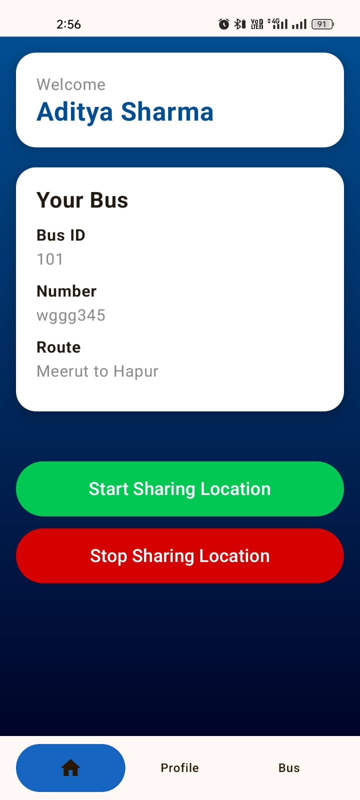
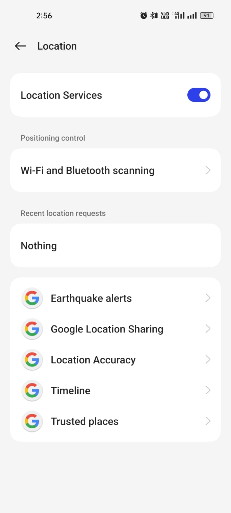
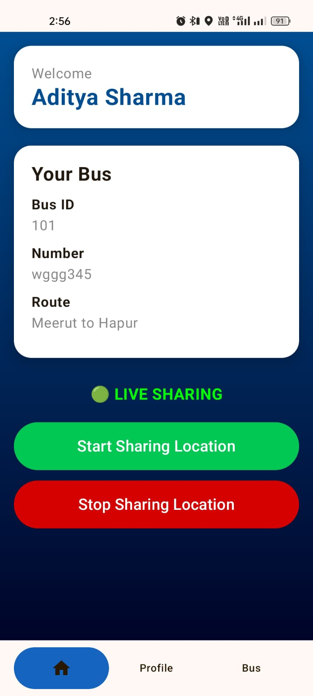
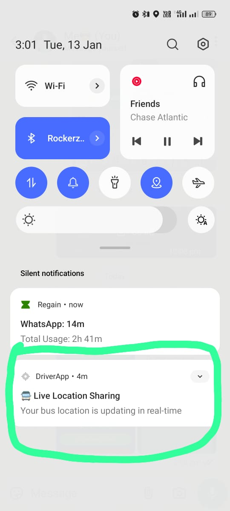
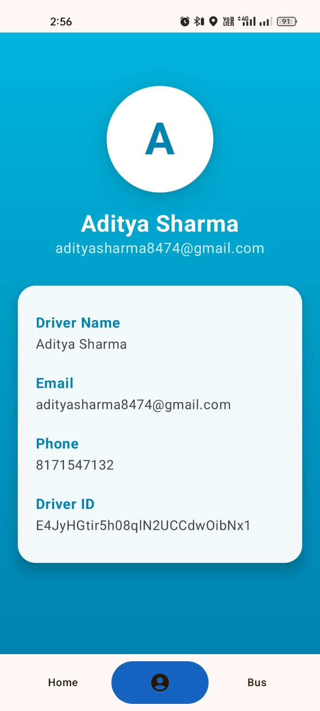
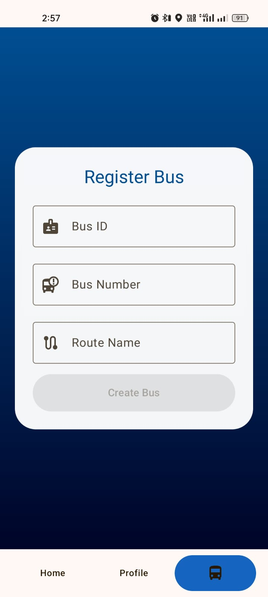

🚍 College Driver App

The College Driver App is a lightweight Android application built to demonstrate real-time location sharing using a foreground service and Firebase.
The app allows a driver to start and stop live GPS sharing of a bus, which is later consumed by the Student App to track the bus on a map.

This project focuses on core Android concepts, clean architecture, and reactive UI updates rather than complex UI or features.

🎯 Project Objective
  * Share live bus location continuously
  * Use Foreground Service for background location updates
  * Upload latitude & longitude to Firebase
  * Follow MVVM + Clean Architecture
  * Use Kotlin Coroutines & StateFlow
  * Build UI using Jetpack Compose

📱 Screens

| DriverHomeScreen | PermissionScreen| StartSharingLocation |
|------------|--------|--------|
|  |  |  | 

| NotificationForForegorund | DriverProfileScreen | RegisterAnotnerBusScreen |
|------------|--------|--------|
|  |  |  | 

🧠 Application Workflow
  1. Driver opens the app
  2. App fetches assigned bus details
  3. Driver clicks Start Sharing Location
  4. A Foreground Service starts
  5. GPS coordinates are received continuously
  6. Location updates are broadcasted inside the app
  7. HomeScreen receives updates via BroadcastReceiver
  8. ViewModel uploads location to Firebase
  9. Student App listens to Firebase and updates map UI
  10. Driver can stop sharing anytime

🔗 Related Project
  🎓 College Student App -> https://github.com/adityasharma455/College_Student_App

 
🚀 Key Features
  * Foreground service for continuous GPS tracking
  * Start / Stop live location sharing
  * Firebase real-time location upload
  * Persistent notification during sharing
  * Live sharing indicator on UI
  * Reactive UI with StateFlow
  * Simple & clean Compose UI

🧩 Tech Stack
  * Category           ->   Technology
  * Language           ->   Kotlin
  * UI	               ->   Jetpack Compose
  * Architecture	     ->   MVVM + Clean Architecture
  * State Management	 ->   StateFlow
  * Concurrency	       ->   Kotlin Coroutines
  * Background Work	   ->   Foreground Service
  * Location           -> 	Android Location Services
  * Backend	           ->   Firebase
  * Dependency         ->   Injection	Koin
  * Build Tool	       ->   Gradle

🏗 Architecture Overview
Presentation Layer
│
├── HomeScreen (Jetpack Compose)
├── HomeViewModel (StateFlow)
│
Domain Layer
│
├── BusUseCase
│
Data Layer
│
├── Repository
├── Firebase Data Source
├── Location Data Source

🧩 Home Screen Logic (High Level)
  * Observes homeState for bus data
  * Observes locationState for location updates
  * Registers a BroadcastReceiver to receive location from service
  * Sends location updates to ViewModel
  * Shows live status using animated UI
  * Controls foreground service lifecycle

⚠️ Challenges Faced

1. Foreground Service & Background Restrictions

Android restricts background location updates heavily.

Solution:
Implemented a proper foreground service with notification to ensure uninterrupted tracking.

2. Real-Time Location Updates

Sending frequent location updates without UI freezes.

Solution:
Used Kotlin Coroutines (Dispatchers.IO) and StateFlow to handle background work efficiently.

🛠 Permissions Used
  * ACCESS_FINE_LOCATION
  * FOREGROUND_SERVICE
  * POST_NOTIFICATIONS (Android 13+)

🚀 Setup Instructions

  1. Clone repository
       git clone git clone https://github.com/adityasharma455/College_Driver_App.git
  2. Open in Android Studio
  3. Add google-services.json in app/
  4. Enable Firebase services:
     * Authentication (Email/Password)
     * Realtime Database
  5. Build & Run on a real device (recommended) 🚀

👨‍💻 Author

Aditya Sharma
Android Developer
Jetpack Compose | MVVM | Clean Architecture | Coroutines | Firebase
